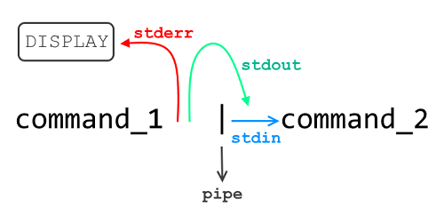

# PIPEX

## Principe
### Version simple
L'objectif du programme Pipex est de recréer le fonctionnement du pipe "|" et des redirections "<" et ">" du shell.
Ainsi le commande suivante :
```bash
$> ./pipex file1 cmd1 cmd2 file2
```
Sera l'équivalent de la commande shell suivante :
```bash
$> < file1 cmd1 | cmd2 > file2
```
Exemple :
```bash
$> ./pipex infile.txt "ls -l" "wc -l" outfile.txt
```
### Version bonus
La version bonus de Pipex permettra de gérer un nombre n de pipes ainsi que les redirections "<<" et ">>",
respectivement l'utilisation d'un Here Document en input et la redirection output en mode append, ajouter.



## Fonctionnement

Il faut tout d'abord comprendre le principe des processus, et pourquoi il est nécessaire de faire appel à un processus enfant pour executer une commande. 
Lorsque l'on execute un programme, un espace mémoire lui est alloué ainsi que des ressources et une stack, et ce jusqu'a l'arret du programme. Cet ensemble constitue une instance appelé processus et est identifié par un numéro, le PID (Process IDentifier). Pour voir l'ensemble des processus en cours, entrez la commande ```bash $> ps -e ``` dans le shell.
De plus, chaque commande (ls, cat, wc...) sont, à l'exeption de certaines qu'il n'est pas necessaire lister ici, eux memes des programmes. Pour pouvoir executer un second programme à travers un premier, nous devons utiliser la fonction **execve()**.
Cette fonction va, si lui a été fourni une commande existante ainsi qu'un chemin d'accès valide, executer la dite commande puis terminer le processus dans lequel elle a été appelée. Cependant dans le cas de notre Pipex nous aurons deux commandes à executer. Comment empecher l'arret de notre programme au premier appel d'execve() ? En faisant appel à la fonction fork() et en créant des processus enfants.

De notre processus principal, dit *parent*, la commande **fork()** fera la copie en un processus secondaire dit *child*. Cette copie implique donc d'allouer un second espace mémoire, de nouvelles ressources, une autre stack. On verra que même les adresses mémoires sont identiques d'un processus à sa copie ! 
L'appel à execve() fait dans un processus child puis ce dernier terminé, nous pouvons ainsi retourner dans notre parent et executer la suite de notre programme.
*Ce principe d'execution de commande à travers un processus child est à la base de l'architecture Unix.*

Notre programme sera donc composé d'un processus parent et de deux processus child pour chacune des commandes. Seulement, nous voulons que le résultat de la première commande executée serve d'input à la seconde. Mais il n'est pas possible de faire communiquer deux processus, sauf avec l'utilisation des pipes.

La fonction **pipe()** permet de créer un *pipe* ou tube, soit un moyen de communication inter-processus unidirectionnel. L'objet pipe peut être défini par une région de mémoire tampon partagée entre deux processus, representée par deux FD (file descriptors), un de lecture (entrée) et un d'écriture (sortie).

L'objectif est donc de faire coincider la sortie de notre child1 avec la sortie de notre child2. Grâce à la focntion **dup2()**, nous pouvons dupliquer et remplacer un FD par un autre. Ainsi, en remplaçant la sortie standard de notre child1 par l'entrée de notre pipe, nous pouvons rediriger nos données dans le bon sens. Reste à appliquer la même logique pour établir la chaîne vers child2 et notre output file, et depuis notre input file.

## Difficultés rencontrées
### Pipes non fermés
Comme le pipe est représenté par deux file descriptors, il est important de les tenir toujours fermés une fois utilisés, sinon des comportements indésirables seront produits. Par exemple, si un descripteur d'ecriture n'est pas fermé, le processus de lecture restera continuellement en attente que de nouvelles données soient écrites, et bloquera le programme indéfiniment.
### Gestion des FDs
La compréhension puis gestion des differents file descriptors a été pour moi assez difficile, surtout de trouver une technique efficace pour gérer les FDs des pipes multiples. 

### Attente des pipes multiples
J'ai pu comprendre par la suite que ma méthode n'est pas la bonne quand à la gestion des pipes multiples. En effet, ma technique ici est de lancer les processus un par un, demandant au parent d'attendre chacun avant de lancer le suivant. Ce qui peut bloquer selon les commandes utilisées ma chaine de pipe. Ce problème est réglé dans le projet Limonshello, afin de coller au fonctionnement de Bash.

## Documentation utilisée
- [Une très bonne explication en français](http://www.zeitoun.net/articles/communication-par-tuyau/start)
- [Tutorial by Zihan](https://csnotes.medium.com/pipex-tutorial-42-project-4469f5dd5901)
- [All you need to know about processes](https://www.tecmint.com/linux-process-management/)
- [Creating and Killing Child Processes in C](https://www.codequoi.com/en/creating-and-killing-child-processes-in-c/)
- [Pipe: an Inter-Process Communication Method](https://www.codequoi.com/en/pipe-an-inter-process-communication-method/)
- [Handling a File by its Descriptor in C](https://www.codequoi.com/en/handling-a-file-by-its-descriptor-in-c/)
